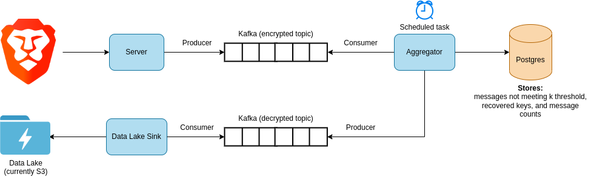

# Constellation Processors

Server-side collector, aggregator and data lake sink for recovering data protected by the nested version of the [STAR](https://arxiv.org/abs/2109.10074) protocol.

Includes:

- Server: for collecting messages protected by Constellation/STAR
- Aggregator: for decrypting message data deemed recoverable
- Data lake sink: for storage of decrypted message data

## Data flow



## Usage

One or more modes must be selected: server (`-s` flag), aggregator (`-a` flag) and/or data lake sink (`-l` flag).

Run `cargo run -- -h` to see options.

### Development environment setup

Copy `.env.example` to `.env`. Run `docker-compose up -d`.

Run `cargo run` with the desired arguments. If the aggregator is run, database migrations will be automatically applied.

#### Collecting measurements/sending test measurements

1. Run a collector/server to collect measurements: `cargo run -- -s`
2. Run the test client in the `misc/test-client` directory. This command will send `k * 10` messages (10 unique measurements) with epoch 1: `cargo run -- -e 1 -u 10`

#### Running aggregation/sinking/viewing results

1. Run data lake sink: `cargo run -- -l`
2. Run the aggregator, with a test current epoch value (usually the current epoch is fetched from the randomness server directly): `cargo run -- -a --test-epoch 1`
3. Use [awscli-local](https://github.com/localstack/awscli-local) to list and copy the jsonl files from the `p3a-star-recovered` bucket.

#### Outputting measurements to stdout

The `--output-measurements-to-stdout` switch can be used to output measurements to the console from the data lake sink or aggregator. If this mode is enabled in the aggregator, measurements will not be sent to the "decrypted" Kafka stream/data lake sink.

### Environment variables

| Name | Default value | Required? | Description |
| -- | -- | -- | -- |
| K_THRESHOLD | `50` | No | The selected _k_ threshold for the Constellation application. |
| KAFKA_BROKERS | | Yes | List of Kafka brokers to connect to. |
| DATABASE_URL | | Yes | Postgres database URL. Used to store recovered keys, unrecovered messages and measurement counts. **The database name must not be included in the URL, it must be provided in the `DATABASE_NAMES` variable.** |
| TEST_DATABASE_URL | | Only if tests are run | Database URL to use for integration tests. **The database name must be included in the URL.** |
| S3_ENDPOINT | | No | Endpoint for connecting to S3. Optional, but useful for development purposes (i.e. connecting to LocalStack). |
| S3_OUTPUT_BUCKET | `p3a-star-recovered` | No | Name of S3 bucket for storing recovered measurements. |
| DATABASE_MAX_CONN | `100` | No | Max connections for Postgres connection pool. |
| DATABASE_MAX_WRITE_CONN | `8` | No | Max connections to use for updates/inserts. A transaction will be created for each connection. |
| LAKE_SINK_BATCH_SIZE | `1000` | No | Number of recovered measurements to store per data lake file. |
| MIN_RECV_RATE_PER_SEC | `100` | No | The minimum consumption rate for encrypted messages. If the consumption rate is below this value, it is assumed that the consumer is near the end of the stream. Consumption will stop if the rate is below this value. |
| MAX_INIT_RECV_TIMEOUT_MS | `30000` | No | The maximum amount of time to wait for an encrypted message to be received, at the beginning of consumption. |
| MIN_MSGS_TO_PROCESS | `1000` | No | The minimum amount of consumed messages to process/aggregate. If the amount consumed is below this value, the process will exit. |
| KAFKA_ENABLE_PLAINTEXT | | No | If set to `true`, TLS will not be used for Kafka connections. |
| KAFKA_TLS_CA_CERT_PATH | | No | CA certificate path to use for Kafka TLS connections. |
| KAFKA_TLS_CERT_PATH | | No | Certificate path to use for Kafka TLS connections. |
| KAFKA_TLS_KEY_PATH | | No | Key path to use for Kafka TLS connections. |
| KAFKA_PRODUCE_QUEUE_TASK_COUNT | `64` | No | Amount of tasks to use for producing Kafka records. |

#### Data channel settings

Each environment variable below can contain multiple data channels, with one value associated with each channel.

The format for an individual data channel setting is `<data channel name>=<value for data channel>`. Multiple channel settings can be configured for each environment variable by using a comma as a delimiter.

| Name | Default value | Required? | Description |
| -- | -- | -- | -- |
| KAFKA_ENCRYPTED_TOPICS | `typical=p3a-star-enc` | No | Topics for storing protected messages. |
| KAFKA_OUTPUT_TOPICS | `typical=p3a-star-out` | No | Topics for storing recovered measurements. |
| DATABASE_NAMES | `typical=postgres` | No | Postgres database names for the aggregator. |
| EPOCH_LENGTHS | `typical=1w` | No | Time periods of the epochs. |
| EPOCH_LIFETIMES | `typical=3` | No | The amount of current & recent previous epochs considered to be 'active'. Epochs older than this lifetime will be consider 'expired', and all partial measurements will be reported at the end of aggregation, if any.  |
| EPOCH_DATE_FIELD_NAMES | `typical=wos` | No | The name of the date fields to inject into the aggregated measurements. The injected field will include the survey date, inferred via the measurement epoch. |

The main channel name can be selected by using the `--main-channel-name` switch. Using this switch will have the following effects:

- If the server is utilized, measurements sent to the `/` path will be sent to the Kafka topic associated with this channel.
- If the aggregator is utilized, the Kafka topics and database name associated with this channel will be used in processing.
- This setting has no effect on the lake sink.

## Test client

A test client can be found in `misc/test-client`.

It can be used to generate random encrypted measurements, create encrypted messages from existing measurements in a CSV and sending the messages to the server.

To generate random measurements and send them to the server, run `cargo run -- -u 10`. This will send 10 random measurements that meet _k_ to the server (1000 messages total, assuming _k_ is set to 100).

To generate messages from existing measurements in a CSV, ensure the CSV is prepared correctly. Columns will be converted to STAR layers in the order defined in the CSV. Ensure the total number of occurences for the measurement is in last column.

Example:
```
question_hash,answer_index,channel,platform,country_code,woi,total
00469a48c5ec8932,0,release,winia32-bc,  ,2022-01-10,1
00469a48c5ec8932,0,release,winia32-bc,  ,2022-01-10,1
00469a48c5ec8932,0,release,winx64-bc,  ,2020-12-21,1
00469a48c5ec8932,0,release,winx64-bc,  ,2022-02-21,2
```

Run `cargo run -- --gen-data-file data.csv`. A file containing encrypted messages will be created.

Run `cargo run -- --messages-file data.b64l` to send the encrypted messages to the server.

See `cargo run -- -h` for all options.
