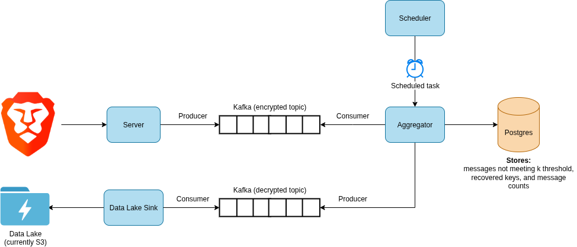

# Constellation Processors

Server-side collector, aggregator and data lake sink for recovering data protected by the nested version of the [STAR](https://arxiv.org/abs/2109.10074) protocol.

Includes:

- Server: for collecting messages protected by Constellation/STAR
- Aggregator: for decrypting message data deemed recoverable
- Data lake sink: for storage of decrypted message data

## Data flow



## Usage

One or more modes must be selected: server (`-s` flag), aggregator (`-a` flag) and/or data lake sink (`-l` flag).

Run `cargo run -- -h` to see options:

```
USAGE:
    constellation-processors [OPTIONS] <--aggregator|--lake-sink|--server>

OPTIONS:
    -a, --aggregator
            Enable aggregator mode

        --agg-iterations <AGG_ITERATIONS>
            Max iterations for aggregator [default: 3]

        --agg-msg-collect-count <AGG_MSG_COLLECT_COUNT>
            Max messages to consume per aggregator iteration [default: 650000]

        --agg-worker-count <AGG_WORKER_COUNT>
            Worker task count for aggregator [default: 16]

    -h, --help
            Print help information

    -l, --lake-sink
            Enable lake sink mode

        --lakesink-consumer-count <LAKESINK_CONSUMER_COUNT>
            Kafka consumer count for lake sink [default: 2]

        --output-measurements-to-stdout
            Output aggregated measurements to stdout instead of Kafka

    -s, --server
            Enable server mode

        --server-worker-count <SERVER_WORKER_COUNT>
            Worker task count for server [default: 16]

        --test-epoch <TEST_EPOCH>
            Current epoch value to use for testing purposes

    -V, --version
            Print version information
```

### Development environment setup

Copy `.env.example` to `.env`. Run `docker-compose up -d`.

Run `cargo install diesel_cli` to install the database migration tool. Run `diesel migration run` to execute DDL on Postgres.

Run `cargo run` with the desired arguments.

#### Collecting measurements/sending test measurements

1. Run a collector/server to collect measurements: `cargo run -- -s`
2. Run the test client in the `misc/test-client` directory. This command will send `k * 10` messages (10 unique measurements) with epoch 1: `cargo run -- -e 1 -u 10`

#### Running aggregation/sinking/viewing results

1. Run data lake sink: `cargo run -- -l`
2. Run the aggregator, with a test current epoch value (usually the current epoch is fetched from the randomness server directly): `cargo run -- -a --test-epoch 1`
3. Use [awscli-local](https://github.com/localstack/awscli-local) to list and copy the jsonl files from the `p3a-star-recovered` bucket.

#### Outputting measurements to stdout

The `--output-measurements-to-stdout` switch can be used to output measurements to the console from the data lake sink or aggregator. If this mode is enabled in the aggregator, measurements will not be sent to the "decrypted" Kafka stream/data lake sink.

### Environment variables

| Name | Default value | Required? | Description |
| -- | -- | -- | -- |
| KAFKA_BROKERS | | Yes | List of Kafka brokers to connect to. |
| DATABASE_URL | | Yes | Postgres database URL. Used to store recovered keys, unrecovered messages and measurement counts. |
| DATABASE_MAX_CONN | 100 | No | Max connections for Postgres connection pool. |
| S3_ENDPOINT | | No | Endpoint for connecting to S3. Optional, but useful for development purposes (i.e. connecting to LocalStack). |
| S3_OUTPUT_BUCKET | p3a-star-recovered | No | Name of S3 bucket for storing recovered measurements. |
| LAKE_SINK_BATCH_SIZE | 1000 | No | Number of recovered measurements to store per data lake file. |
| KAFKA_ENCRYPTED_TOPIC | p3a-star-enc | No | Topic for storing protected messages. |
| KAFKA_OUTPUT_TOPIC | p3a-star-out | No | Topic for storing recovered measurements. |
| K_THRESHOLD | 100 | No | The selected _k_ threshold for the Constellation application. |

## Test client

A test client can be found in `misc/test-client`.

It can be used to generate random encrypted measurements, create encrypted messages from existing measurements in a CSV and sending the messages to the server.

To generate random measurements and send them to the server, run `cargo run -- -u 10`. This will send 10 random measurements that meet _k_ to the server (1000 messages total, assuming _k_ is set to 100).

To generate messages from existing measurements in a CSV, ensure the CSV is prepared correctly. Columns will be converted to STAR layers in the order defined in the CSV. Ensure the total number of occurences for the measurement is in last column.

Example:
```
question_hash,answer_index,channel,platform,country_code,woi,total
00469a48c5ec8932,0,release,winia32-bc,  ,2022-01-10,1
00469a48c5ec8932,0,release,winia32-bc,  ,2022-01-10,1
00469a48c5ec8932,0,release,winx64-bc,  ,2020-12-21,1
00469a48c5ec8932,0,release,winx64-bc,  ,2022-02-21,2
```

Run `cargo run -- --gen-data-file data.csv`. A file containing encrypted messages will be created.

Run `cargo run -- --messages-file data.b64l` to send the encrypted messages to the server.

See `cargo run -- -h` for all options.
